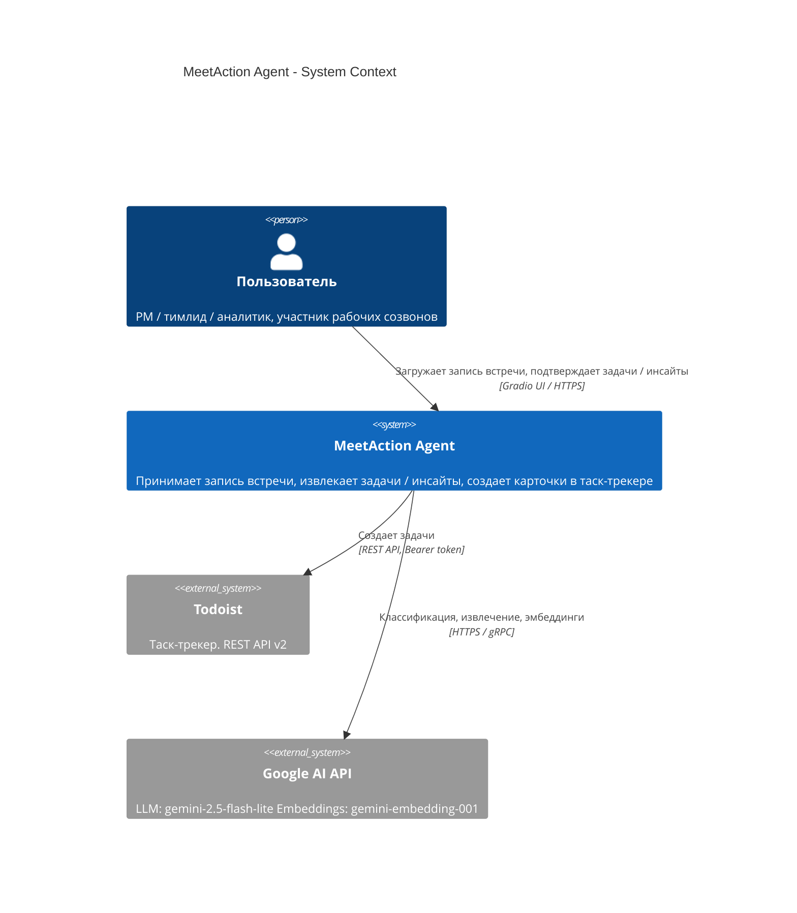
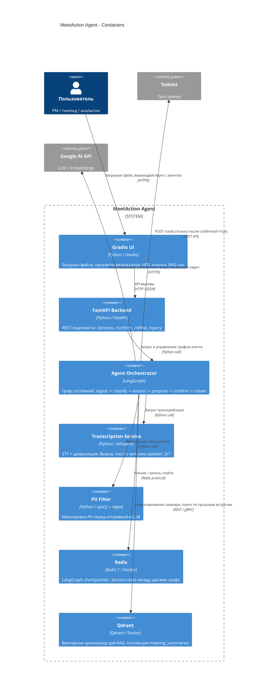
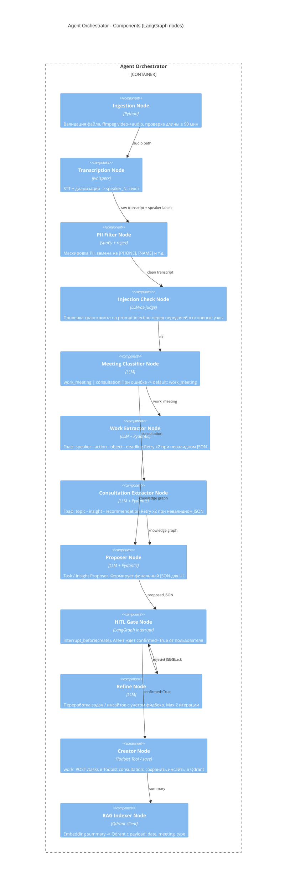
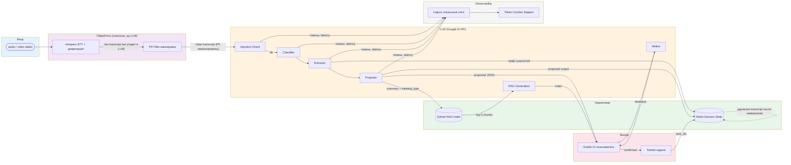

# Diagrams: MeetAction Agent (PoC)

---

## C4 Level 1 - Context

Показывает систему целиком, ее пользователей и внешние зависимости.

---

## C4 Level 2 - Container

Показывает внутренние контейнеры системы, их роли и взаимодействия.

---

## C4 Level 3 - Component (Agent Orchestrator)

Внутреннее устройство ядра системы граф узлов LangGraph

---

## Workflow / Graph Diagram

Пошаговое выполнение запроса со всеми ветками ошибок *См. `system-design.md`, раздел 3 - Основной workflow*

---

## Data Flow Diagram

Как данные проходят через систему, что хранится и что логируется.

**Что хранится:**
- **Redis** - session state (временно, удаляется после завершения сессии)
- **Qdrant** - summary встреч без PII, meeting_type, дата (постоянно)
- **Логи** - latency, токены, коды ошибок (локально, без текстов промптов)

**Что НЕ хранится:**
- Сырой транскрипт после завершения сессии
- Оригинальный аудио/видео файл после транскрибации
