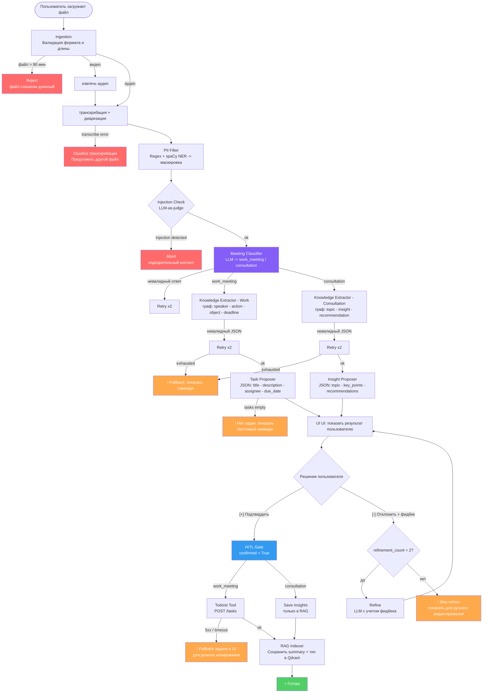

# System Design

## 1. Ключевые архитектурные решения

| Решение | Выбор | Обоснование |
| :--- | :--- | :--- |
| **Агентный фреймворк** | LangGraph | Явный граф состояний, проще контролировать переходы и встроить human-in-the-loop |
| **STT + диаризация** | `whisperx` (faster-whisper + pyannote/speaker-diarization-3.1) | Офлайн, транскрибация + диаризация, аудио не уходит из контура до PII-фильтрации |
| **LLM** | `google/gemini-2.5-flash-lite-preview-09-2025` | 1M контекст покрывает даже длинные транскрипты без map-reduce, цена: ~10 ₽/1M вход, ~42 ₽/1M выход |
| **Таск-трекер** | Todoist REST API | Бесплатный тариф, простой REST |
| **Session State** | Redis | Стандарт для хранения состояния, production-like, поднимается одной строкой в `docker-compose` вместе с Qdrant |
| **RAG-индекс** | Qdrant | REST + gRPC API, фильтрация по payload, production-like |
| **Embeddings** | `google/gemini-embedding-001` | 20K контекст, ~15 ₽/1M input токенов, output бесплатный |
| **Стек** | python 3.11, FastAPI, Gradio UI | База |

---

## 2. Список модулей и их роли

| Модуль | Роль |
| :--- | :--- |
| **UI (Gradio)** | Загрузка файла, отображение результатов, кнопки Подтвердить / Отклонить / Редактировать; чат для RAG-вопросов |
| **Ingestion Service** | Прием файла, конвертация video2audio (`ffmpeg`), валидация формата и длины (< 90 мин) |
| **Transcription Module** | `whisperx`: транскрибация + диаризация -> текст с метками `speaker_0`, `speaker_1`, таймкодами |
| **PII Filter** | regex + spaCy NER: маскирует телефоны, e-mail, финансовые данные перед отправкой в LLM |
| **Agent Orchestrator** (LangGraph) | Управляет графом состояний |
| **Meeting Classifier** | Определяет тип встречи, `work_meeting` или `consultation`, выбирает downstream-пайплайн |
| **Knowledge Extractor (work_meeting)** | LLM из транскрипта строит граф `(speaker, action, object, deadline)` -> таски |
| **Knowledge Extractor (consultation)** | LLM из транскрипта извлекает `(topic, insight, recommendation)` -> структурированное саммари |
| **Task Proposer** | Из графа work_meeting формирует JSON `{title, description, assignee, due_date}` |
| **Insight Proposer** | Из графа consultation формирует JSON `{topic, key_points, recommendations}` |
| **Human-in-the-Loop Gate** | Агент ждет явного approve |
| **Todoist Tool** | POST `/tasks` в Todoist API, только для work_meeting, только после `confirmed=True` |
| **RAG Module** | Qdrant + LangChain Retriever, отвечает на вопросы по прошлым встречам обоих типов |
| **Observability** | loguru + токен-счетчик, локальное хранение, без отправки во внешние системы |

---

## 3. Основной workflow



---

## 4. State / Memory / Context Handling

### Session State (Redis, LangGraph checkpointer)

- Стейт сериализуется в Redis через LangGraph, что дает персистентность между шагами графа
- После создания задач / сохранения инсайтов транскрипт **удаляется из Redis** (политика PII)
- В Qdrant пишутся только: session_id, timestamp, meeting_type, краткое summary (PII уже замаскированы)

### Memory Policy (RAG)

- Qdrant локально, коллекция `meeting_summaries`
- Документы - summary встречи + тип встречи (PII замаскированы), payload: `{date, meeting_type, participants_count}`
- Retrieval топ 3 по cosine similarity, threshold 0.75
- Фильтрация по payload, можно искать только по `work_meeting` или только по `consultation`

---

## 5. Retrieval-контур (RAG)

**Цель:** отвечать на вопросы по прошлым встречам "кто обещал сдать отчет?", "что решили на прошлой неделе?"

| Параметр | Значение |
| :--- | :--- |
| **Источник данных** | Саммари прошлых встреч обоих типов (сохраняются после подтверждения) |
| **Индекс** | Qdrant, коллекция `meeting_summaries` |
| **Документы** | Весь summary одной встречи = один документ (< 2000 токенов) |
| **Metadata / payload** | `{date, meeting_type, participants_count}` для фильтрации |
| **Embedding** | `google/gemini-embedding-001` через Google AI API |
| **Поиск** | топ 3 по сosine similarity, опциональный фильтр по `meeting_type` + фильтр по периоду |
| **Reranking** | - |
| **Fallback** | Если Qdrant пуста или similarity < 0.75 -> "Нет данных по прошлым встречам" |
| **Ограничение** | RAG недоступен до первой успешно завершенной сессии |

---

## 6. Tool / API интеграции

### Todoist REST API

| Параметр | Значение |
| :--- | :--- |
| **Endpoint** | `POST https://api.todoist.com/api/v1/tasks` |
| **Auth** | Bearer token (из env `TODOIST_API_TOKEN`) |
| **Payload** | `под таблицей` |
| **Timeout** | 10 секунд |
| **Retry** | 1 retry при 5xx, без retry при 4xx |
| **Side effects** | Создание задачи в Todoist **необратимо**, только после `confirmed=True` |
| **Защита** | Tool физически недоступен без флага `confirmed=True` в AgentState |
| **Ошибки** | 401 -> "Проверьте токен"; 429 -> "Rate limit, подождите"; 5xx -> fallback (показать задачи в UI) |


```
{
  "content": "string",
  "description": "string",
  "project_id": "6XGgm6PHrGgMpCFX",
  "section_id": "6fFPHV272WWh3gpW",
  "parent_id": "6XGgmFVcrG5RRjVr",
  "order": 12,
  "labels": [
    "string"
  ],
  "priority": 2,
  "assignee_id": 123456789,
  "due_string": "string",
  "due_date": "string",
  "due_datetime": "string",
  "due_lang": "string",
  "duration": 30,
  "duration_unit": "minute",
  "deadline_date": "2025-02-12"
}
```


### Google AI API (Gemini)

| Параметр | Значение |
| :--- | :--- |
| **LLM** | `google/gemini-2.5-flash-lite-preview-09-2025` (extraction, proposer, RAG-generation) |
| **Embeddings** | `google/gemini-embedding-001` (RAG индексирование и поиск) |
| **Контекст LLM** | 1M токенов - транскрипт любой длины в одном вызове, map-reduce не нужен |
| **Timeout** | 60 секунд на LLM-вызов |
| **Retry** | exponential backoff, до 2 попыток |
| **Budget guard** | Счетчик токенов в сессии; при > 500k входящих токенов предупреждение |
| **Стоимость типичной сессии** | ~50k токенов вход + ~3k выход ≈ **0.63 ₽** за встречу |

---

## 7. Failure Modes, Fallbacks, Guardrails

| Failure | Детект | Fallback |
| :--- | :--- | :--- |
| whisperx не запустился | Exception при старте процесса | Показать ошибку, предложить другой файл |
| LLM вернул невалидный JSON | Pydantic validation error | Retry x2 -> показать сырой транскрипт |
| Meeting Classifier дал невалидный ответ | Pydantic validation error | Retry x2 -> default: `work_meeting` |
| LLM не нашел задач / инсайтов | Пустой список `proposed_output` | Вернуть краткое саммари встречи |
| Todoist API недоступен | HTTP 5xx / timeout | Показать задачи в UI для ручного копирования |
| Prompt injection в транскрипте | LLM-as-judge (отдельный вызов перед extraction) | Abort сессии, показать предупреждение |
| Файл > 90 мин | Длина аудио при загрузке | Reject на этапе Ingestion с понятным сообщением |
| Redis недоступен | ConnectionError при старте | Fallback на in-memory dict, предупреждение в логах |
| Qdrant недоступен | ConnectionError при RAG-запросе | Отключить RAG для сессии, предупредить пользователя |

**Guardrails:**
- Транскрипт подается в промпт исключительно в тегах `<transcript>...</transcript>`, изоляция от системных инструкций
- Системный промпт оборачивается в Pydantic-схему, не конкатенируется со строками пользователя
- `create_task` tool заблокирован на уровне кода (`if not state["confirmed"]: raise PermissionError`)
- Максимум 2 итерации refinement, дает защиту от бесконечного цикла

---

## 8. Технические и операционные ограничения

| Параметр | Ограничение | Обоснование |
| :--- | :--- | :--- |
| **Макс. длина аудио** | 90 минут | Транскрипт ~20-30k токенов легко умещается в 1M контекст Gemini |
| **p95 latency (без Whisper)** | < 30 сек | Целевой SLO из product-proposal |
| **p95 latency Whisper** | ~3–5 мин для 90 мин аудио (CPU) | Ожидаемо для `whisper-base` на CPU; не входит в SLO агента |
| **Бюджет LLM** | ~100 ₽ на весь PoC | ~100 запусков сессий при ~0.63 ₽/встреча + тесты промптов |
| **Максимум refinement итераций** | 2 | Защита от бесконечного цикла |
| **Context budget** | 1M токенов | Map-reduce не нужен, весь транскрипт в одном вызове |
| **Надежность Todoist API** | Best-effort (нет SLA в бесплатном тарифе) | Fallback - показ задач в UI |